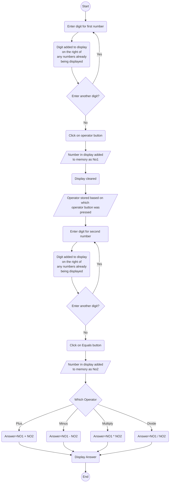

# WebAppExamples

The following files are included in this repository

## 1) BasicCalcCompleted.html

This file is a basic calculator app. I have included the Style (CSS), Script (JavaScript 
and interface (HTML) in one page for simplicity:


[File Link](https://github.com/NeilParkerBSDC/WebAppExamples/blob/main/BasicCalcCompleted.html)

* * *
*Further Files Yet To Be added*

## 2) BasicCalcCompletedSeparateButtons.html

This is a variation on th files above with separate buttons for each operation. This means putting each operation (i.e. +, -, *, /) into different functions which are called in turn by the four seprate buttons. I have also tweeked the CSS to give the ```<div>``` and the buttons a drop shadow.


[File Link](https://github.com/NeilParkerBSDC/WebAppExamples/blob/main/BasicCalcCompletedSeparateButtons.html)

## 3) TradCalc.html

This calculator takes a different approach. The aim is to replicate a tradition hand held calculator. There are different buttons for all the input numbers and opertors etc. Each calls different function:


[File Link](https://github.com/NeilParkerBSDC/WebAppExamples/blob/main/TradCalc.html)

The operation of this app is as follows:




